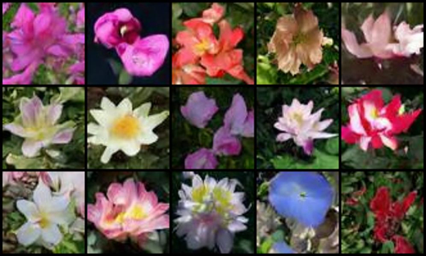
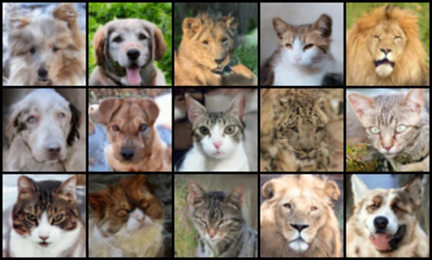

# Denoising Diffusion Probabilistic Model (DDPM)

This repository contains my personal implementation of a Denoising Diffusion Probabilistic Model (DDPM), based on the paper by [Ho et al](https://arxiv.org/pdf/2006.11239), using PyTorch. The project is designed with extensibility in mind and will evolve to include several enhancements and alternative sampling techniques.

<table style="width=100%; border:0px">
  <tr>
    <td align="center" style="padding:0 10px; width=50%">
    <p><b>Generated images</b></p>
      
      <br>
       <!-- <sub>102 flowers</sub> -->
       <!-- <br><br> -->
      
      <br>
      <!-- <sub>AFHQ V2</sub> -->
    </td>
    <td align="center" style="padding:0 10px;width=50%">
    <p><b>Denoising process</b></p>
      
       <br>
       <!-- <sub>102 flowers</sub> -->
       <!-- <br><br> -->
      
      <br>
      <!-- <sub>AFHQ V2</sub> -->
    </td>
  </tr>
</table>

### ✔️ Currently Implemented Features:
- **Beta schedulers:** 
    - Linear (with zero terminal SNR option, as proposed [here](https://arxiv.org/pdf/2305.08891))
    - Cosine (proposed [here](https://arxiv.org/pdf/2102.09672))
    - Sigmoid
- **Optimizations:**
    - Mixed precision
    - Gradient clipping
- **Training objectives:**
    - Noise
    - V loss
- **Architecture:** UNet with attention (implementation borrowed from [OpenAI](https://github.com/openai/guided-diffusion/blob/main/guided_diffusion/unet.py ))

### 🚧 Upcoming Features:
- Gradient accumulation
- DDIM sampling procedure
- Evaluation metrics: FID and Inception Score

---

## ✏️ Environment Setup

Assuming that you have Python and CUDA Toolkit installed, to set up the project environment:

**Linux**
```bash
python3 -m venv .venv
source .venv/bin/activate
pip install --no-cache-dir -r requirements.txt
```

**Windows**
```bash
Set-ExecutionPolicy Unrestricted -Scope Process #(if needed, works only for current Powershell session)
python -m venv .venv
.venv/Scripts/activate
pip install --no-cache-dir -r requirements.txt
```

**Note:** you might need to adjust the `requirements.txt` according to the CUDA Toolkit version installed on your system.

---

## 🔧 Usage

### Configuration

Create a JSON configuration file in the `configs` directory to define training parameters and paths to the dataset and results. Example configurations are included for:

- VGG's 102 Category Flower Dataset ([link](https://www.robots.ox.ac.uk/~vgg/data/flowers/102/))

- AFHQ ([link](https://github.com/clovaai/stargan-v2/tree/master))

These files can be used as templates for your own experiments. Customize the `data_dir` field with the path to your training data, and set the `weights` and `plots` fields to specify where the final model weights and loss plots should be saved, respectively.

### Training

Run the training notebook:

- Open `train.ipynb`

- In the second cell, set the path to your config file by editing the `CONFIG_PTH` variable.

- Execute the notebook to start training.
